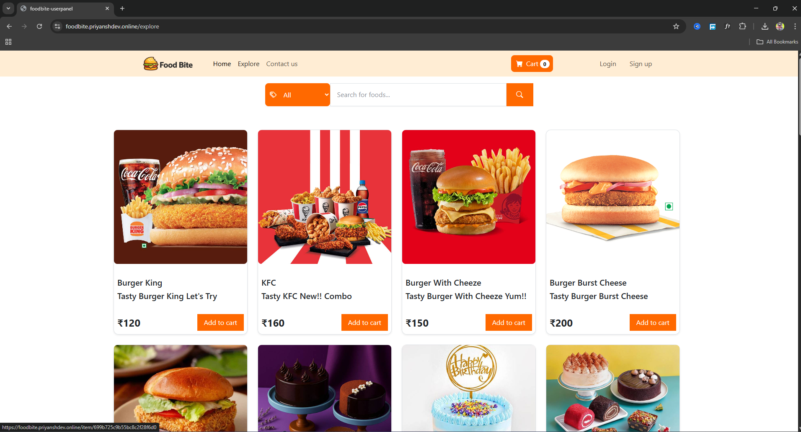
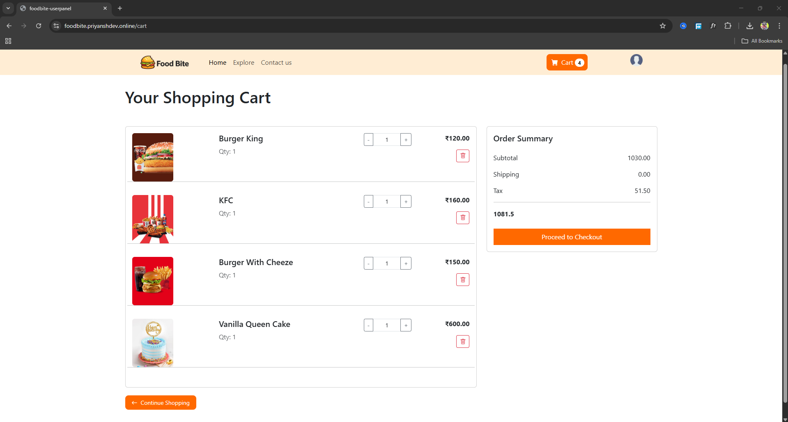
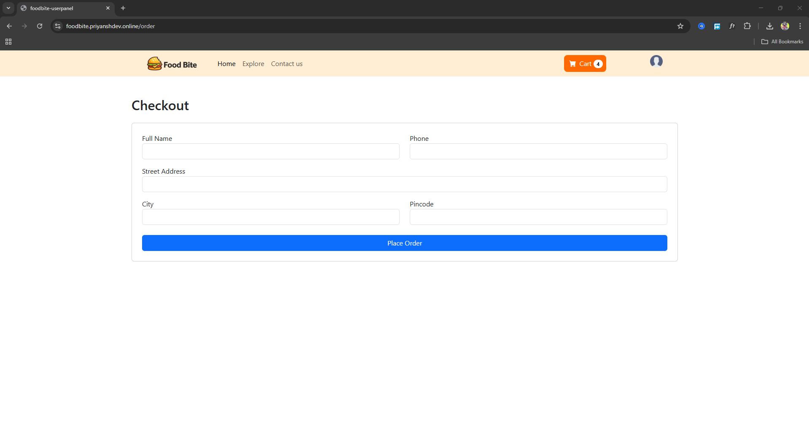
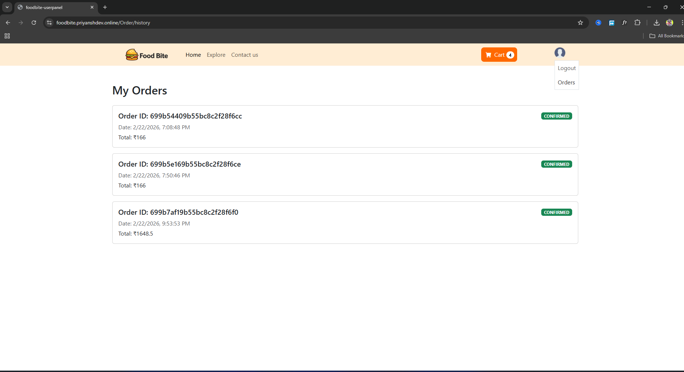

# 🍴 FoodBite – Full Stack Food Ordering Platform
###  Spring Boot • React • MongoDB • JWT Authentication • AWS S3 • Full Stack Architecture

 **Live Project:** [foodbite.priyanshdev.online](https://foodbite.priyanshdev.online)

##  Description
FoodBite is a full-stack food ordering web application built using **Spring Boot** for backend and **React (Vite)** for frontend.  
The platform allows users to explore food items, manage carts, and place orders, while admin manage products and monitor customer orders through a dedicated admin panel.

The project focuses on building a structured backend with JWT authentication, MongoDB data handling, AWS S3 image storage, and a dynamic frontend experience.

➡️ UI enhancements and minor feature improvements are ongoing.

---

## Why I Built FoodBite
I was curious about how e-commerce platforms work on the backend and wanted to explore how to build a full-stack system end to end.  
I created FoodBite to understand real-world flow like product management, cart logic, authentication, and order processing.  
This project also serves as a personal reference so I can revisit how I implemented a complete system from backend to frontend.


---

##  Features

### 🔐 Admin Panel
- Admin can add new food products.
- Admin can view product list, edit products, and delete products.
- Admin can view all customer orders.
- Role-based authorization for admin panel is planned for future updates.

### 👤 User Panel
- Visitors can explore pages without login.
- Live text search with category filter on explore page.
- JWT authentication with token stored in local storage.
- Token automatically removed on logout.

### 🛒 Cart & Order Flow
- Only authenticated users can add products to cart.
- Quantity update with dynamic calculation.
- Cart includes subtotal, tax, shipping charge, and total price.
- Address form before placing order.
- Toast notification after successful order placement.
- Users can view only their own order history.
- Admin can view all orders.

---

##  Architecture Overview

### Backend (Spring Boot)
- RESTful API structure using Controller → Service → Repository layers
- JWT-based authentication and secure endpoints
- MongoDB integration for products, users, carts, and orders
- AWS S3 integration for product image upload

### Frontend (React)
- Context API for global state management
- Axios for backend communication
- React Router DOM for navigation
- Toast notifications for user actions

---

##  Backend Tech Stack / Dependencies

###  Core Backend
- Spring Boot
- Spring Web MVC
- Spring Validation

### ️ Database
- MongoDB
- Spring Data MongoDB

### 🔐 Security
- Spring Security
- JWT (jjwt-api, jjwt-impl, jjwt-jackson)

###  Cloud Storage
- AWS S3 SDK

###  Development Tools
- Lombok
- Spring Boot DevTools

---

##  Frontend Tech Stack

###  Core Frontend
- React (Vite)
- React Router DOM
- Context API
- Props & Component-based architecture

###  API Communication
- Axios

###  UI & Styling
- Bootstrap
- Tailwind CSS
- Bootstrap Icons
- React Toastify

---

## API Structure
- `/foodBite/auth/**` – Authentication (login & signup)
- `/foodBite/**` – Product listing and management
- `/cart/**` – Cart operations and calculation
- `/my/order/**` – Order placement and history
- `/my/order/admin/**` – Admin operations

---
## 📸 Screenshots

### User Interface

####  Explore


####  Cart Page


####  Checkout Flow


####  Order History


---

### 🍽 Admin Panel (Private Module)


---

## 📁 Project Structure

```
FoodBite/
│
├── backend/
│   └── src/main/java/com/foodBite/FoodBite/
│       ├── awsConfig/
│       ├── controller/
│       ├── entity/
│       ├── modal/
│       │   ├── request/
│       │   └── response/
│       ├── repository/
│       ├── security/
│       ├── service/
│       │   └── Impl/
│       ├── filter/
│       └── util/
│
│   └── resources/
│       ├── application.properties
│       ├── static/
│       └── templates/
│
├── FoodBite_Adminpanel/
│   ├── components/
│   ├── pages/
│   ├── services/
│   └── assets/
│
├── FoodBite_Userpanel/
│   ├── components/
│   ├── context/
│   ├── pages/
│   ├── service/
│   └── assets/
│
└── README.md
```

## ▶️ How to Run the Project

### 1️⃣ Download Project

Download the repository as ZIP and extract it.

---

### 2️⃣ Run Backend (Spring Boot)

Make sure MongoDB is running.

```
cd backend
mvn spring-boot:run
```
### 3️⃣ Run Admin Panel
```
cd FoodBite_Adminpanel
npm install
npm run dev

```
### 4️⃣ Run User Panel

```
cd FoodBite_Userpanel
npm install
npm run dev

```


